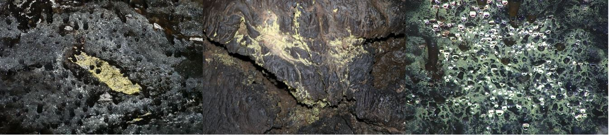

# Overview.

The Biomarker Dataset offers a comprehensive collection of still images and videos capturing secondary features found in lavatubes, specifically yellow biofilm, polyps, and collaloids. Using Electro-optical sensor such as handheld mirrorless camera(Sony RX100 VII) and DSLR camera(Canon Rebel T7i), as well as PTZ camera(Spot cam+), the dataset provides high-resolution visuals for detailed analysis. The dataset was captured within [Lava Beds National Monument, CA](https://www.google.com/maps/place/Lava+Beds+National+Monument/@41.8027968,-121.5726266,13z/data=!4m6!3m5!1s0x54cea67ae59ba40d:0xd388a0ca3c885cfb!8m2!3d41.7750276!4d-121.5067874!16zL20vMDFuM3I0), which comprises a collection of caves where various secondary features can be observed. It was acquired during the second field deployment period of the [BRAILLE](https://nasa-braille.org/) research project, which is funded by NASA's Planetary Science and Technology through Analog Research program(PSTAR).

# Sample Images.
## Yellow Biofilm

## Polyps

## Collaloids

# Biomarker dataset.
| Camera | Caves | Total img / video | Link |  
|:-:|:-:|:-:|:-:|
| Sony RX100-VII               | Golden Dome, Valentine, Mammoth, Lyons, Post Office                    |  568 / 168 | [link](https://drive.google.com/drive/folders/1rHAyhwzDFIaC--E44frmBW09jlCmNBYY?usp=sharing)
| Spot Cam+ (PTZ)              | Mushpot, Golden Dome, Valentine, Mammoth, Hopkins Chocolate Lyons, Post Office |  929 /  0  | [link](https://drive.google.com/drive/folders/1Xk8DGz7SDbosZXJJG1o_C5hiVQUXlYhk?usp=sharing)
| Canon EOS Rebel T7           | Valentine, Mammoth         |   68 /  0  | [link](https://drive.google.com/drive/folders/1DDnvs4wp0ckMVmHMNqVbNheoUKgGjWed?usp=sharing)
